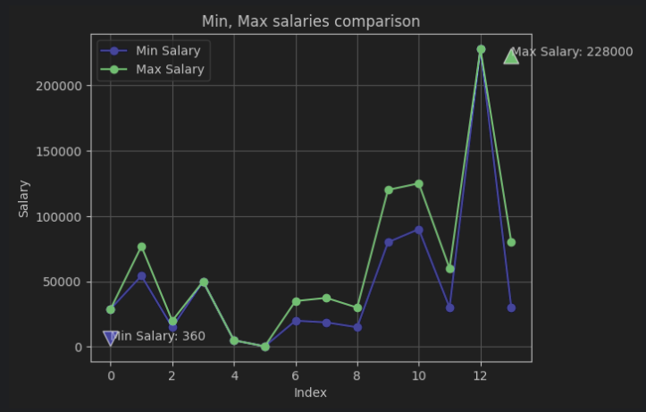

# Python porfolio scraper and analyzer
This project was created for parsing python developer remote vacancies and analize their max values, min values and averages values for best salary understanding.
## How to use it?
### Installing
- Go to `<> Code` button
- Copy `HTTPS` link
- Paste to cmd, write commmand `git clone [link]`
### Code redactor part
- Write in console `cd app` command
- Install all libs
- Firstly launch `parse.py` file(There you pick all data about vacancies)
- Then lauch `validate_by_pd` to validate csv file, creating new file with vacancies without not needed data
- Then start `plt_stats.ipynd` and watch histograms with plots for best salaries understanding
- If you want to update data, delete previous files and do all steps again
### Portfolio images
# 1

# 2

# 3

The end
